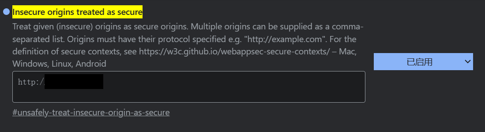
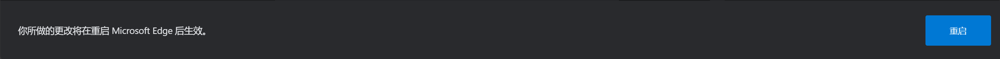

# 欢迎访问视界之声的Android开源仓库！

- 这里存放了两个后端程序的源码以及相关功能函数和模型：

  - 运行web_camera.py以启动智慧拍照的后端程序
  - 运行web_img_analyse.py以启动环境识别的后端程序
  - place_365文件夹下是项目包含的深度学习模型

- 在templates文件夹下你可以找到前端代码

- 项目依赖可以在requirements.txt中找到

- 直接运行后端代码会生成http协议的局域网IP，但由于浏览器禁止http访问用户设备，如果你希望查看运行效果，你需要先修改一些浏览器配置，如下：

  1. 在地址栏中输入以下指令
     - Chrome: chrome://flags/#unsafely-treat-insecure-origin-as-secure
     - Edge: edge://flags/#unsafely-treat-insecure-origin-as-secure
  
  2. 安全地址列表中加入代码运行环境的局域网IP，非80端口需要加上端口信息
  
  3. 选择"enable"或"启用"
  4. 点击空白处，然后重启浏览器
  

