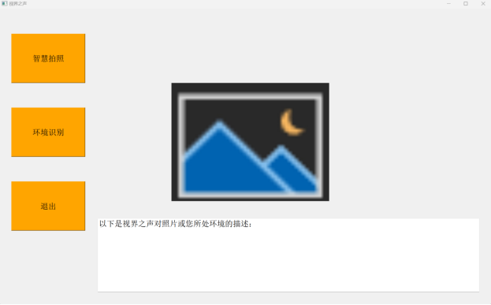
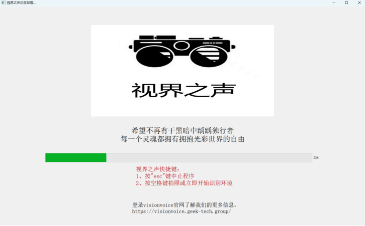
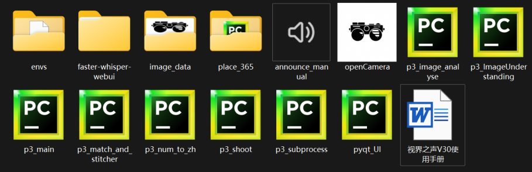
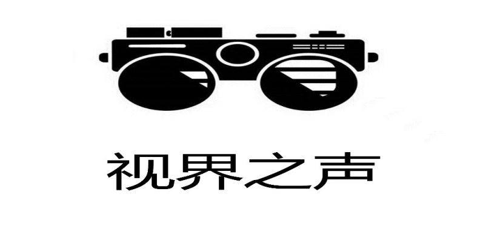

# 视界之声V3.0使用手册

###### 西安电子科技大学 “视界之声”团队

## 一、产品概述
### （一）产品简介
视界之声V3.0（以下简称为本产品）是一款帮助视障人士（以下简称为用户）拍照和出行的**无障碍软件**。通过人脸检测、语音识别和语音播报等高新技术，本产品将辅助用户完成自拍；通过场景识别和环境检测等高新技术，本产品将帮助用户分析附近的环境，从而辅助用户出行。
本产品分为Windows端（openCamera.exe）和Android端（VisionVoice）。本产品当前版本为V3.0版本。使用本产品无须注册任何用户账号，但是必须打开设备（Windows电脑或Android移动端）的摄像头。

### （二）功能及使用
打开本产品后，本产品将通过语音播报提醒（本产品中的提醒方式均为语音播报提醒，以下简称为提醒）用户“欢迎使用智慧盲人相机，请选择您的服务：1.智慧拍照；2.环境识别”选择本产品所拥有的两种功能：1.智慧拍照；2.环境识别。用户可以通过说“智慧拍照”或“环境识别”（Windows端用户也可以点击左侧的三个按钮来选择对应功能）来启用对应的功能，或者说“退出”来退出本产品。

**Windows端产品图示**：(最下册的文本框会把对照片和视频的识别结果以文字形式呈现)

Windows端直接打开“VisionVoice.exe”就可以使用该产品。打开后，会出现一个如下图所示的加载动画，加载结束后便会进入上图的界面，表示本产品启动成功。Windows端可以通过按esc键快速退出本产品或者按空格键立即拍照（“智慧拍照”）或立即开始识别环境（“环境识别”）。

#### 1.智慧拍照
开启“智慧拍照”之后，本产品将语音提示“欢迎开启智慧拍照”并弹出一个拍照窗口，检测用户脸部所在位置。如果脸部偏离摄像头（相机正中心），本产品将通过语音播报“向左”“向右”“向上”“向下”来提醒用户调整自己的脸部位置；如果检测不到任何一张人脸，本产品将播报“看不到你”来提醒用户；如果检测到多张人脸，本产品将以距离摄像头最近的一个人为提醒调整脸部位置的对象（在窗口中，这个人的脸部周围会有一个绿色矩形边框，其余人的脸部周围会有一个灰色矩形框）。当用户说“拍照”后，本产品会拍照并语音播报提示“拍照成功”。拍照后，本产品会立刻分析这张照片拍摄的内容、地点和周围环境。分析内容会语音播报给用户并以文字形式在界面下方的文本框中输出。
请注意：
##### Windows端产品：
用户通过“智慧拍照”拍下的照片会在VisionVoice目录下以“photo_0.jpg”形式保存；“环境识别”自动识别的图像会在目录“VisionVoice\image_data”下以“image_(num).jpg”形式保存。其中，Windows端保存的照片名字一定是“photo_0.jpg”且新的照片会覆盖旧的照片。如果用户使用Windows端，请及时更改保存照片的文件名或者将照片“photo_0.jpg”放到其他目录（即文件夹）中，以免丢失之前使用本产品（Windows端）拍摄的照片。
并且，“VisionVoice\image_data”下会存在一个“picture2.jpg"和一个“dst_start_img.jpg”的文件，请不要删除，它们是UI的初始化界面，一旦删除，本产品将无法打开和正常运行！

##### Android端产品：
用户通过“智慧拍照”拍下的照片会保存在Android手机相册中。

#### 2.环境识别
开启“环境识别”后，本产品将提醒用户“好的，听到录像开始后请缓慢地转动镜头，总时长24秒或15秒，我将根据镜头的画面识别当前环境，当画面重复时我会自动停止”，之后用户可以在本产品提醒“录像开始”之后通过平稳地旋转摄像头来录制周围的环境，随后本产品将提醒“录像结束”并智能识别用户周围的环境（注意，录像时长最多为24秒（Windows端）或15秒（Android端），并且本产品一旦连续检测到相同环境就会立刻停止录像并开始分析环境；而且，当Windows端用户按下空格键后同样会立刻停止录像并开始分析环境）。几秒钟后，本产品将通过语音播报向用户描述其周围的环境，并将描述内容放在界面下方。注意，使用此功能时本产品必须联网。
Android端用户可以通过点击界面上方“重新开始”按钮重新进行环境识别。

当“智慧拍照”或“环境识别”功能使用完毕后，本产品将提醒用户“您可以说“退出”以退出程序，或继续选择服务：1.智慧拍照；2.环境识别”。用户可以根据提示通过说“智慧拍照”或“环境识别”的方式（Windows端用户也可以点击左侧对应按钮，Android端用户也可以点击移动端屏幕中间按钮）继续选择使用对应功能或通过说“退出”的方式退出本产品。

## 二、运行环境及下载方式
#### 1.运行环境
本产品分为Windows端产品和Android端产品。Windows端产品可以在Windows环境运行；Android端产品可以在Android手机上运行。

#### 2.下载方式
通过访问 https://visionvoice.life 可以下载本产品。
点击该网站首页右下角的“下载Windows体验版”按钮下载Windows端产品，或者扫描该网站首页左下角二维码下载手机Android版产品。

##### Windows端：
点击 https://visionvoice.life 中的“下载Windows体验版”按钮后会在用户电脑上下载一个VisionVoice_3.0_Setup.exe 。打开该.exe文件即可下载Windows端产品，用户可以根据VisionVoice_3.0_Setup.exe 提示下载本产品，下载完成后会自动在桌面创建快捷方式。用户可以自由选择下载地址。下载后，用户也可以找到“VisionVoice”文件夹，并通过打开openCamera.exe（如下图）文件使用本产品。
用户还可以通过打开“VisionVoice”文件夹中的“announce_manual.exe”（如下图）即可语音朗读本使用手册中文版（打开“VisionVoice”文件夹中的“announce_manual_English.exe”即可语音朗读本手册英文版）。
如果您不再希望使用本产品，可以通过双击unins000.exe一键卸载本产品。同时，我们真诚希望您能在我们的官方网站https://visionvoice.life上向我们提出意见和建议，让我们做出更令人满意的产品。
注意：下载路径（包括“VisionVoice”文件夹名称）不能有中文，否则“智慧拍照”功能将无法正常使用！

##### Android端： 
扫描 https://visionvoice.life 中的二维码即可在用户的移动端上下载“视界之声”Android端产品。该产品以一个黑色的酷似墨镜的相机作为应用和Logo图标，应用名称为VisionVoice。用户可以直接触摸移动端上的应用图标或者使用移动端厂商自带的无障碍功能打开该应用。启动后会先用动画短暂展示如下图所示的产品Logo，动画结束后手机上便有上下两个按钮“智慧拍照”和“环境识别”，分别对应功能“智慧拍照”和“环境识别”。以上两个功能的介绍详见上文“一、产品概述”中“（二）功能及使用”章节。
移动端用户也可以通过语音启动Android端应用以及“智慧拍照”和“环境识别”功能。
本产品暂时不支持iOS端使用。

## 三、版本信息
本产品现有最新版本为V3.0版本，更新于2023年12月7日17:00。
本使用手册最近一次更新于2024年3月20日21:00。
如果您想了解本产品及其开发团队的更多信息，或者想对我们团队提出意见和建议，或者想要反馈使用产品时遇到的问题、错误或漏洞，请访问：https://visionvoice.life

感谢您对本产品的支持！

